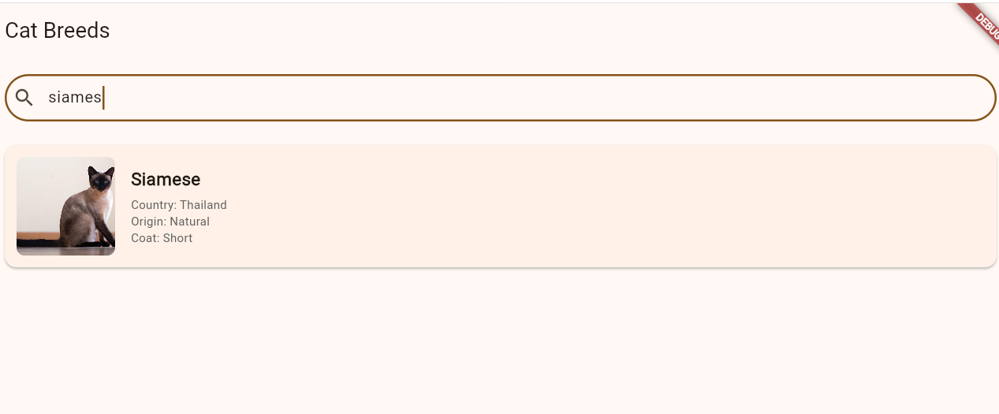

# cat_directory_app

App desarrollada en Flutter que permite explorar diversas razas de gatos, obtener detalles técnicos de cada una y disfrutar de curiosidades aleatorias.

## Características
- Listado de razas: visualización de razas y datos obtenidos del api de CatFact.
- Detalle de Raza: Información específica sobre origen, pelaje y país.
- Imágenes Inteligentes: Implementación de una estrategia de fallback que busca fotos reales en TheCatAPI y utiliza Cataas como respaldo.
- Cat Facts: Sección de "Random Facts" para los amantes de los felinos.
- Navegación Fluida: Uso de animaciones Hero para transiciones de imágenes.

## Tecnologías
Framework: Flutter
Gestión de Estado: Flutter BLoC
Inyección de Dependencias: Get It
Cliente HTTP: Dio
Arquitectura: Clean Architecture (domain, data, presentation)

## Instalación y Uso
1. clonar repositorio:
   git clone https://github.com/tu-usuario/cat_directory_app.git
2. Instalar dependencias:
   flutter pub get
3. correr para web:
   flutter run -d chrome --web-browser-flag "--disable-web-security"

## Vista Previa

  

| Listado de Razas | Búsqueda y Detalle |
| :---: | :---: |
|  |  |

> *Arriba: Sección de "Random Cat Facts" implementada con éxito.*

## Autor: Annabella Mendoza
Estudiante de Ingeniería de Sistemas - Unimet
This project is a starting point for a Flutter application.
*Desarrollado con ❤️ para Nextep.*

